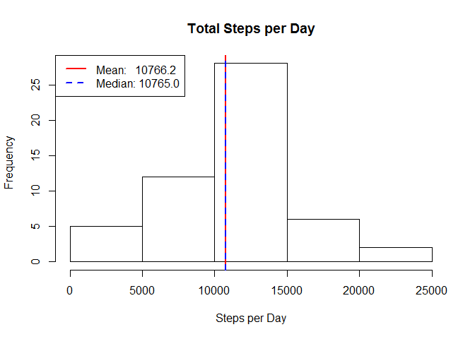
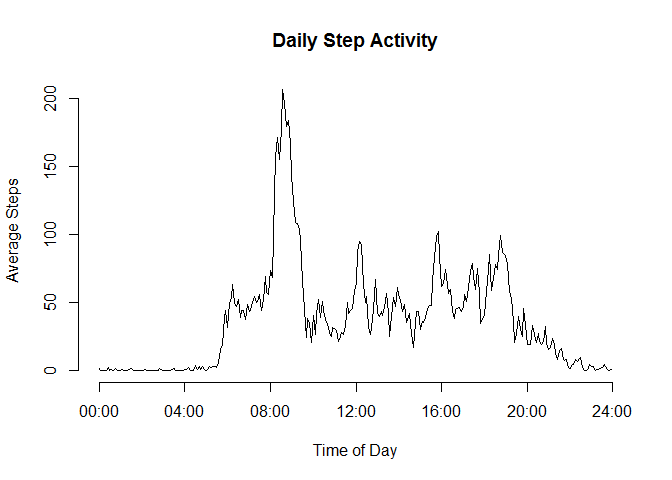
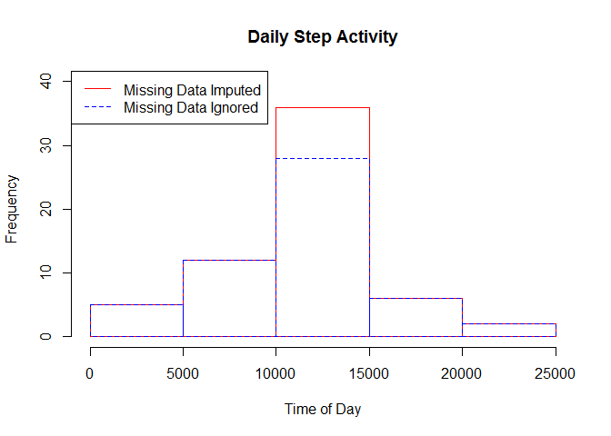
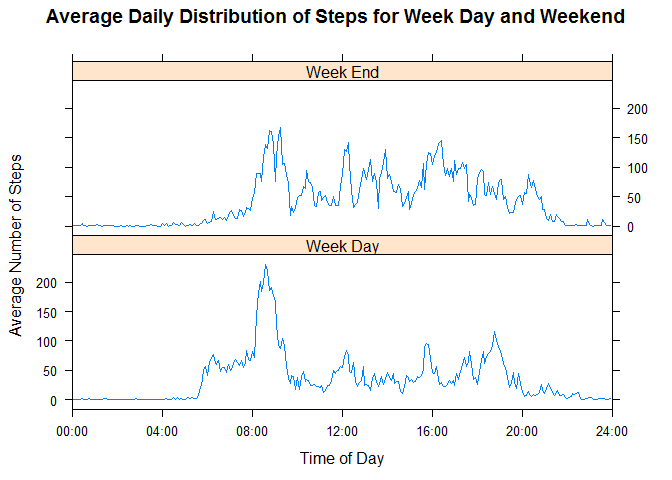

# Reproducible Research: Peer Assessment 1


## Loading and preprocessing the data
The data file is in csv format. Load it accordingly. Take a quick look at the
data with the head() and tail() functions.

```r
act <- read.csv("activity/activity.csv")
head(act)
```

```
##   steps       date interval
## 1    NA 2012-10-01        0
## 2    NA 2012-10-01        5
## 3    NA 2012-10-01       10
## 4    NA 2012-10-01       15
## 5    NA 2012-10-01       20
## 6    NA 2012-10-01       25
```

```r
tail(act)
```

```
##       steps       date interval
## 17563    NA 2012-11-30     2330
## 17564    NA 2012-11-30     2335
## 17565    NA 2012-11-30     2340
## 17566    NA 2012-11-30     2345
## 17567    NA 2012-11-30     2350
## 17568    NA 2012-11-30     2355
```
The interval column is incrementing by 5; however, the integer value represented
is the digital clock reading of a 24-hour clock. A sample day roll-over 
(2355 to 0) is shown below
as well as an example hour roll-over (55 to 100).

```r
act[287:290,]
```

```
##     steps       date interval
## 287    NA 2012-10-01     2350
## 288    NA 2012-10-01     2355
## 289     0 2012-10-02        0
## 290     0 2012-10-02        5
```

```r
act[299:303,]
```

```
##     steps       date interval
## 299     0 2012-10-02       50
## 300     0 2012-10-02       55
## 301     0 2012-10-02      100
## 302     0 2012-10-02      105
## 303     0 2012-10-02      110
```
For convenience, a continous representation of "interval" in minutes is calculated
and added to the data frame. The day-time date is built also. These 
quantities have practical use later in the analysis.

```r
# generate a "continuous" time vector of minutes into day
daymin <- trunc(act$interval/100)*60 + act$interval-100*trunc(act$interval/100) 
# construct the date
daytime <- strptime( 
        paste( act$date, sprintf( "%04d", act$interval)), "%Y-%m-%d %H%M")
# combine new representaion of time and original data
act <- cbind( act, daytime, daymin)
```

## Daily Steps
Frist, the total number of steps per day is calculated and tabulated in the
per_day data frame.

```r
 per_day <- aggregate( steps ~ date, data=act, FUN=sum)
```

The following plot shows the histogram of total steps per day.

```r
 hist( per_day$steps, xlab="Steps per Day", main="Total Steps per Day")
 abline( v=mean(per_day$steps), lty=1, col="red", lwd=2)
 abline( v=median(per_day$steps), lty=2, col='blue', lwd=2)
legend( "topleft", 
        c( sprintf( "Mean:   %0.1f", mean(per_day$steps)),
           sprintf( "Median: %0.1f", median(per_day$steps)) ),
        lty = c( 1, 2), lwd = c(2, 2), col=c("red", "blue"))
```

 

The mean of steps taken per day is:

```r
mean(per_day$steps)
```

```
## [1] 10766.19
```
The median of steps taken per day is:

```r
median(per_day$steps)
```

```
## [1] 10765
```


## Average Daily Activity Pattern
The following implements the calculation of the average number of steps
taken within 5-minute intervals over all days. First load library.

```r
library(dplyr)
```

```
## 
## Attaching package: 'dplyr'
## 
## The following object is masked from 'package:stats':
## 
##     filter
## 
## The following objects are masked from 'package:base':
## 
##     intersect, setdiff, setequal, union
```
Perform calculation (remove missing values)

```r
by_int <- group_by( act, interval)
mean_by_int <- summarize( by_int, ave = mean(steps, na.rm=TRUE))
```
### Plot of Average Steps versus Time Interval
Construct the plot of average steps versus interval (e.g. time of day)

```r
plot( mean_by_int$ave, type="l", axes=FALSE, xlab="", ylab="" )
# want time of day labels on x axis
inttimes <- factor( strftime(  act$daytime, "%H:%M") )
axis( 1, c( seq(1, 288, 48), 289),
         c( as.character(inttimes[seq(1, 288, 48)]), "24:00"))
# use default for y axis
axis(2)
# label the axes
title( xlab = "Time of Day", ylab = "Average Steps",
       main = "Daily Step Activity" )
```

 

### Peak Activity
The peak in activity (around 8:35 estimated by viewing the plot) is confirmed by
finding the maximum average steps within the mean_by_int data frame. Display
the frame associated with the maximum.

```r
mean_by_int[ mean_by_int$ave==max(mean_by_int$ave),]
```

```
## Source: local data frame [1 x 2]
## 
##   interval      ave
## 1      835 206.1698
```

## Imputing missing values
There are missing observations in the data set. The number of missing rows is
shown next.

```r
length( which(!complete.cases(act)))
```

```
## [1] 2304
```
When a sample is missing, the mean value for the associated time of day will be
used to fill it in.

```r
# find missing observations
missing_rows = which( !complete.cases(act))
# what time of day do they correspond to
missing_tod = unique( act$interval[missing_rows])
# create new data set
newact <- act
# loop over time of day intervals and fill in missing data
for (k in seq_along(missing_tod) ) {
        n <- which( is.na(newact$steps) & newact$interval==missing_tod[k])
        newact$steps[n] <- rep( mean_by_int$ave[k], length(n))
        }
```

## Mean and Median with Imputed Data
The average steps per day are re-calculated using the imputed data. Since the
missing data was filled in with average data, the overall
average should match the original calculation in which missing data was
ignored.

```r
 new_per_day <- aggregate( steps ~ date, data=newact, FUN=sum)
```
The mean of steps taken per day is:

```r
mean(new_per_day$steps)
```

```
## [1] 10766.19
```
The median of steps taken per day is:

```r
median(new_per_day$steps)
```

```
## [1] 10766.19
```

The following plot compares the histogram of mean steps per day with/without imputing.

```r
 hist( new_per_day$steps, border="red", axes=FALSE, xlab="", ylab="", main="", ylim=c(0,40))
 par( new=TRUE)
 hist( per_day$steps, border="blue", ylim=c(0,40), lty=2, 
       xlab = "Time of Day", main= "Daily Step Activity")
 legend( "topleft", 
        c( sprintf( "Missing Data Imputed"),
           sprintf( "Missing Data Ignored") ),
        lty = c( 1, 2), col=c("red", "blue"))
```

 

```r
 par(new=FALSE)
```

## Comparison in activity patterns between weekdays and weekends
To compare the activities, the (imputed) data set is factored by week-day/week-end.
To do this, the numerical
equivalent of week day is extracted from the daytime vector determined earlier.
Then, the data is grouped and
summarized accordingly to get the week day and week end averages.

```r
wd <- as.numeric(strftime(newact$daytime, '%u'))  # days of week 1 to 7, 1: MON
newact$weekd <- "Week End"
newact$weekd[wd<6] <- "Week Day"
newact$weekd <- factor(newact$weekd)
by_int_day = group_by( newact, daymin, weekd)
mean_by_int_by_day <- summarize( by_int_day, ave=mean(steps))
```
Compare average week-day and week-end stepping activity using panel plotting
methods from lattice library (start by loading it)

```r
library(lattice)
```
The plot shows that the subject's week-day diurnal activities follow a more 
defined pattern than for the week-end. Night time is generally quiet. The subject
appears to get up around 6:00 on week-days, followed perhaps by same physical
exercise around 8:30. The week-end rise time is variable since there is no sharp
increase in the morning hours. Also, the subject tends to stay up a bit later on
the week-ends.

```r
xyplot( ave ~ daymin|  weekd, data = mean_by_int_by_day, 
        layout=c(1,2), type="l", 
        scales = list( 
                x=list( at=seq(0,1440,240), 
                        limits = c(0, 1440),
                        labels=c( as.character(inttimes[seq(1, 288, 48)]), "24:00"))
                ),
        xlab="Time of Day",
        ylab="Average Number of Steps",
        main="Average Daily Distribution of Steps for Week Day and Weekend"
        )
```

 

